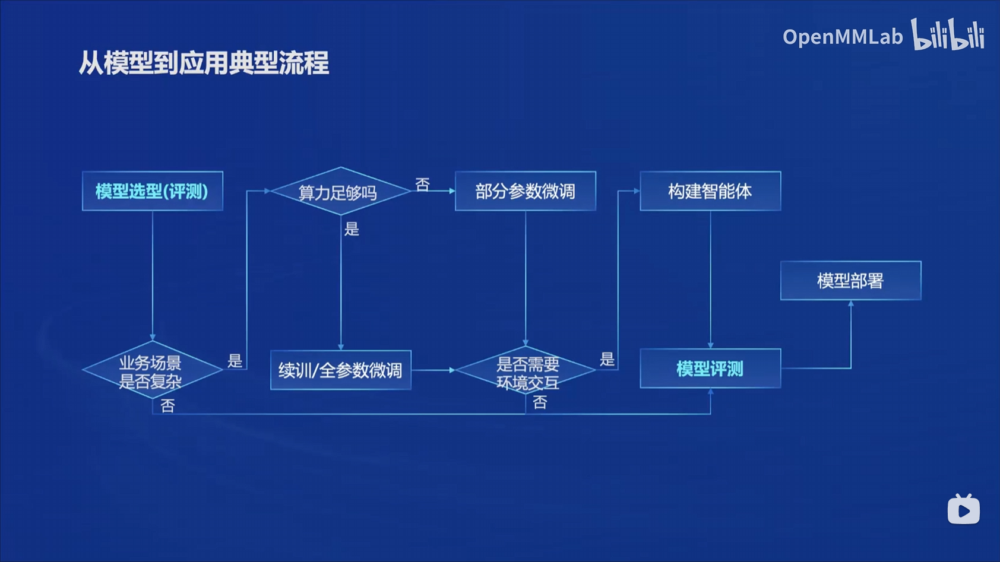

# 笔记一：书生·浦语大模型全链路开源体系

7B和20B两种参数量，从具有强泛化能力的模型基座开始，进行fine-tuning/RAG以适配应用领域

主要亮点：

从模型到应用的典型流程：业务场景？算力？环境交互？

全链路开放体系：
- 数据：书生·万卷，2TB，高质量，多模态，多任务
- 预训练：InterLM-Train，并行加速
- 微调：XTuner，支持全参数微调和LoRA等低成本微调
- 部署：LMDeploy
- 评测：OpenCompass，全方位评测
- 应用：Lagent/AgentLego，构建智能体，支持代码解释其等多种工具

微调：增量续训or有监督微调
- 增量续训：直接利用书籍文档代码等数据注入知识
- 有监督微调：需要标注大量高质量对话/问答数据

