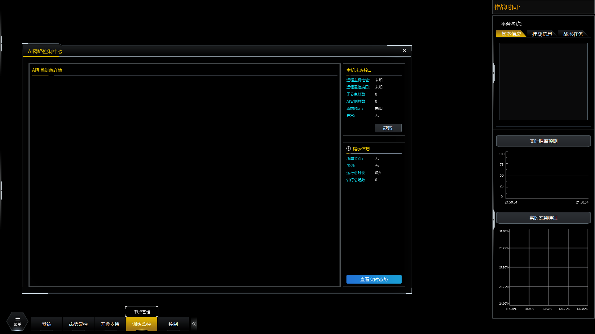

# 作业二：书生·浦语大模型demo

### 基础作业：使用 InternLM2-Chat-1.8B 模型生成 300 字的小故事

### 进阶作业：熟悉 huggingface 下载功能

### 进阶作业：完成 Lagent 工具调用 数据分析 Demo 部署

需要开启30% A100算力权限

### 进阶作业：完成 浦语·灵笔2 的 图文创作 及 视觉问答 部署

需要开启50% A100算力权限