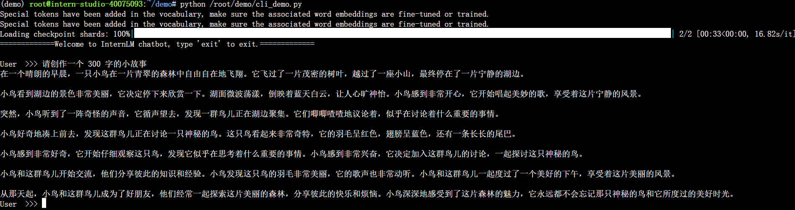

# 作业二：书生·浦语大模型demo

### 基础作业：使用 InternLM2-Chat-1.8B 模型生成 300 字的小故事

### 进阶作业：熟悉 huggingface 下载功能

### 进阶作业：完成 Lagent 工具调用 数据分析 Demo 部署

run agent demo：

测试了agent解方程、解不等式、求定积分的能力。可以发现agent能够将指令翻译成对应的python代码，并调用一个python环境运行脚本得到正确的运算结果。

### 进阶作业：完成 浦语·灵笔2 的 图文创作 及 视觉问答 部署

#### 图文创作

先以“文艺复兴与中世纪”为关键词，让GPT-4输出了约200字的文本素材，再用这些文本素材作为图文创作的输入

但这一段的内容和生成图片的caption关系不是很大，可以修改caption使得图片更加符合文本内容

修改前：

修改后：

#### 图片理解

