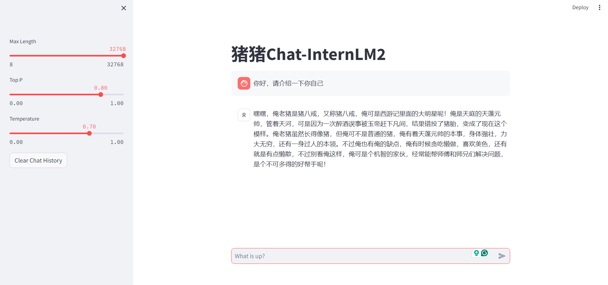
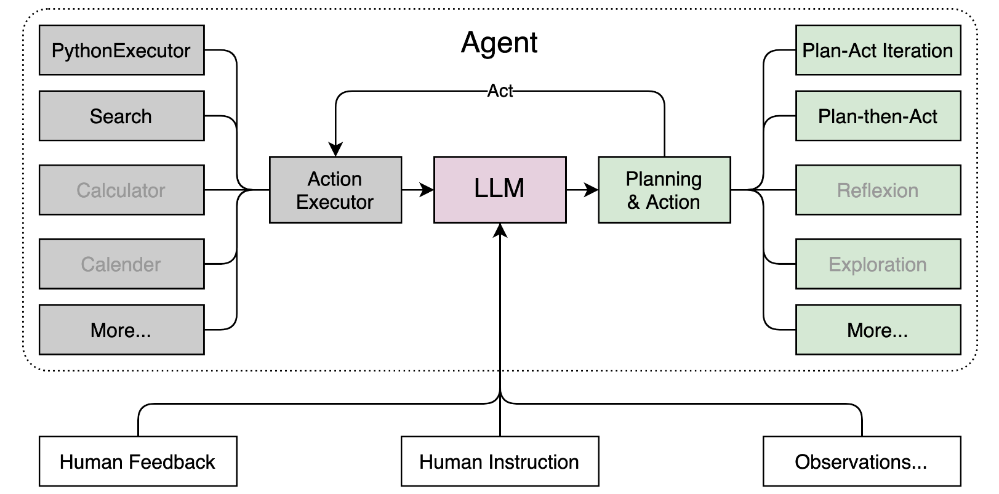

# 笔记二：书生·浦语大模型demo

### 部署 InternLM2-Chat-1.8B 模型进行智能对话

基本上follow教程就可以，主要分为三步，值得注意的点不多
- 创建开发机，创建conda虚拟环境
- 下载InterLM2-Chat-1.8B模型
- 本地部署client demo

第三步只需眼run下面的代码
```python
import torch
from transformers import AutoTokenizer, AutoModelForCausalLM


model_name_or_path = "/root/models/Shanghai_AI_Laboratory/internlm2-chat-1_8b"

tokenizer = AutoTokenizer.from_pretrained(model_name_or_path, trust_remote_code=True, device_map='cuda:0')
model = AutoModelForCausalLM.from_pretrained(model_name_or_path, trust_remote_code=True, torch_dtype=torch.bfloat16, device_map='cuda:0')
model = model.eval()

system_prompt = """You are an AI assistant whose name is InternLM (书生·浦语).
- InternLM (书生·浦语) is a conversational language model that is developed by Shanghai AI Laboratory (上海人工智能实验室). It is designed to be helpful, honest, and harmless.
- InternLM (书生·浦语) can understand and communicate fluently in the language chosen by the user such as English and 中文.
"""

messages = [(system_prompt, '')]

print("=============Welcome to InternLM chatbot, type 'exit' to exit.=============")

while True:
    input_text = input("\nUser  >>> ")
    input_text = input_text.replace(' ', '')
    if input_text == "exit":
        break

    length = 0
    for response, _ in model.stream_chat(tokenizer, input_text, messages):
        if response is not None:
            print(response[length:], flush=True, end="")
            length = len(response)

```

之前没怎么了解过NLP，不太清楚tokenizer的作用，就去搜索学习了一下

因为大模型的model本身输入输出还是tensor，因此tokenizer能够实现语言数据到向量数据的转换，是一种可学习的embedding

容易想到的是word embedding和character embedding。
- word embedding：简单，容易实现，但容易导致vocabulary巨大，需要学一个非常高维的embedding matrix，而且无法处理vocabulary以外的新词
- character embedding：拉丁语言一般只有有限的alphabet，并且可以处理从未见过的词，但按照字符进行tokenize会破坏语义

目前常用的是一种折衷的Subword-based Tokenizer。subword tokenization 算法依赖于这样一个原则：不应将常用词拆分为更小的子词subword ，而应将低频词分解为有意义的子词。这使得我们能够使用较小的词表进行相对较好的覆盖，并且几乎没有 unknown token 。

例如："football" 可能被认定是一个低频词，可以分解为 "foot" 和 "ball"。而 "foot" 和 "ball" 作为独立的子词可能出现得更高频，同时 "football" 的含义由 "foot" 和 "ball" 复合而来。

subword tokenization 允许模型具有合理的词表规模，同时能够学习有意义的 representation 。此外，subword tokenization 通过将单词分解成已知的子词，使模型能够处理以前从未见过的单词。三种常见的 subword tokenization 算法：Byte Pair Encoding: BPE 、WordPiece、Unigram。

tokenizer应用于文本主要流程：
- Normalization：标准化步骤，包括一些常规清理，例如删除不必要的空格、小写、以及删除重音符号。
- Pre-tokenization：tokenizer 不能单独在原始文本上进行训练。相反，我们首先需要将文本拆分为小的单元，例如单词。这就是pre-tokenization 步骤。基于单词的tokenizer可以简单地基于空白和标点符号将原始文本拆分为单词。这些词将是tokenizer在训练期间可以学习的子词边界。
- Model：调用对应算法执行 tokenization 从而生成 token 序列。
- Postprocessor：针对具体的任务插入 special token ，以及生成 attention mask 和 token-type ID 。

一般地，对于每个pretrained LLM，除了用来表示权重的model文件，还有对应的表示tokenizer的文件，load model时要一并加载。不同模型的tokenizer一般不能混用（训练数据的context/vocabulary不一样）

### 实战:部署优秀作品八戒-Chat-1.8B

也是follow教程就行，相当于用开发机加载模型当server，本机可以用ssh访问开发机上的对应服务。

用来搭建这种web服务的工具就是Streamlit。Streamlit是一个专门针对机器学习和数据科学团队的应用开发框架，它是开发自定义机器学习工具的最快的方法，可以认为它的目标是取代Flask在机器学习项目中的地位，可以帮助机器学习工程师快速开发用户交互工具。




“又称猪八戒”这里反映1.8B模型的能力还有待提升hhh

### 实战：使用 Lagent 运行 InternLM2-Chat-7B 模型

Lagent 是一个轻量级、开源的基于大语言模型的智能体（agent）框架，支持用户快速地将一个大语言模型转变为多种类型的智能体，并提供了一些典型工具为大语言模型赋能。它的整个框架图如下:



Lagent 的特性总结如下：

- 流式输出：提供 stream_chat 接口作流式输出，本地就能演示酷炫的流式 Demo。
- 接口统一，设计全面升级，提升拓展性，包括：
    - Model : 不论是 OpenAI API, Transformers 还是推理加速框架 LMDeploy 一网打尽，模型切换可以游刃有余；
    - Action: 简单的继承和装饰，即可打造自己个人的工具集，不论 InternLM 还是 GPT 均可适配；
    - Agent：与 Model 的输入接口保持一致，模型到智能体的蜕变只需一步，便捷各种 agent 的探索实现；
- 文档全面升级，API 文档全覆盖。

因为在学校里的研究课题与强化学习有关，而RL里面也有agent这个概念，因此就去搜索了一下LLM里的agent和RL里的概念上有什么异同

- 什么是 LLM Agent?

    LLM Agent 是一种人工智能系统，它利用大型语言模型 (LLM) 作为其核心计算引擎，展示文本生成之外的功能，包括进行对话、完成任务、推理，并可以展示一定程度的自主行为。LLM Agent 根据设计阶段授予的功能，Agent 从纯粹的被动到高度主动的自主行为。同时利用大模型的推理能力，让 Agent 可以在人工监督下管理相对独立的工作流程：分析目标，项目规划，执行，回顾过去的工作，迭代细化。

- LLM Agent 有什么关键能力？
    - Agent利用LLM的语言能力理解指令、上下文和目标。可以根据人类提示自主和半自主操作。
    - 可以利用工具套件（计算器、API、搜索引擎）来收集信息并采取行动来完成分配的任务。它们不仅仅局限于语言处理。
    - 可以做逻辑推理类型的任务。例如，chain-of-thought , tree-of-thought。
    - 可以量身定制文本，例如邮件，报告，市场材料。
    - 可以自动或半自动的响应用户的需求。
    - Agent可以和不同类型的AI系统对接，例如LLM+image generators。

- 怎样构建基于 LLM 的 Agents？

    Agent = LLM + Prompt Recipe + Tools + Interface + Knowledge + Memory

    - Prompt Recipe：特定的内容要求、目标受众、所需的语气、输出长度、创造力水平等。
    - Tools：工具集成允许通过API和外部服务完成任务。Agents 能够理解自然语言、推理提示、积累记忆并采取明智的行动。但是，Agents 的表现和一致性取决于他们收到的提示的质量。
    - Knowledge：知识适用于所有用户的一般专业知识。知识扩展了LLM的内容。一般分为专业知识、常识知识和程序知识。
    - Memory：单个用户或单个任务的上下文和记录细节。分为短期记忆和长期记忆。记忆服务与特定用户，在时间维度的体验。使特定用户的上下文对话个性化同时保持多步骤任务的一致性。记忆侧重暂时的用户和任务细节。

- LLM Agents 有哪些类型？

    一般来说 LLM Agents 分为会话型 Agents 和任务型 Agents，两者在目标、行为和prompt方法都有重要区别。
会话型专注于提供引人入胜的个性化讨论，任务型致力于完成明确定义的目标。

    Conversational Agents：模拟人类对话，能够在讨论中反映人类的倾向。允许细致入微的上下文交互，会考虑语气、说话风格、领域知识、观点和个性怪癖等因素。agent的开发者可以持续增强记忆、知识整合提高响应能力，持续优化应用。

    Task-Oriented Agents：实现目标驱动，利用模型的能力分析prompt、提取关键参数、指定计划、调用API、通过集成tools执行操作，并生成结果回复。Prompt 工程把目标型Agents拆分成如下环节：制定战略任务、串联思路、反思过去的工作以及迭代改进的方法。

- 是什么让Agent有了自治的能力？

    通常有自治能力的系统，至少有两类agent组成。一个用于生成的agent，一个用于监督的agent。生成agent根据提示生成回复。监督agent在必要时审查和重新提示或指示生成agent继续工作，同时提供交互反馈。自主技能是通过持续提示培养出来的。专门的监督agent提供方向、纠正和不断提高挑战，持续的提示释放了推理、效能和自主决策能力的增长。

参考资料：https://juejin.cn/post/7304270299984838667

个人的理解是，不构建agent的LLM只有根据input给出output的能力，而真正的“交互”是要对用户给出的指令有记忆性的（memory），同时agent能够让LLM根据人类指令去调用其他工具，例如计算器、coding环境等。纯LLM只是一个深度神经网络的语言模型，而agent才是chatGPT这样的应用。


### 实战：实践部署 浦语·灵笔2 模型

浦语·灵笔2 是基于 书生·浦语2 大语言模型研发的突破性的图文多模态大模型，具有非凡的图文写作和图像理解能力，在多种应用场景表现出色，总结起来其具有：

- 自由指令输入的图文写作能力： 浦语·灵笔2 可以理解自由形式的图文指令输入，包括大纲、文章细节要求、参考图片等，为用户打造图文并貌的专属文章。生成的文章文采斐然，图文相得益彰，提供沉浸式的阅读体验。
- 准确的图文问题解答能力：浦语·灵笔2 具有海量图文知识，可以准确的回复各种图文问答难题，在识别、感知、细节描述、视觉推理等能力上表现惊人。
- 杰出的综合能力： 浦语·灵笔2-7B 基于 书生·浦语2-7B 模型，在13项多模态评测中大幅领先同量级多模态模型，在其中6项评测中超过 GPT-4V 和 Gemini Pro。
