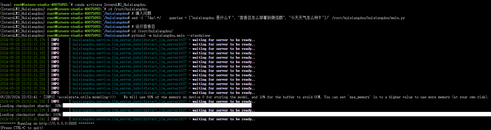
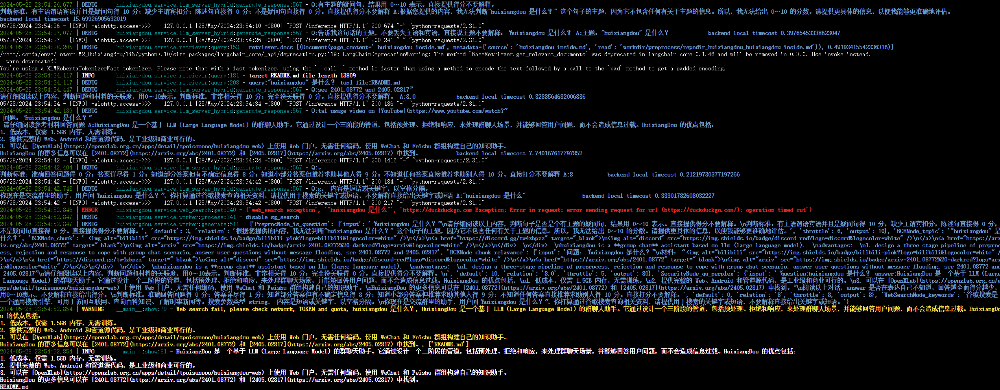
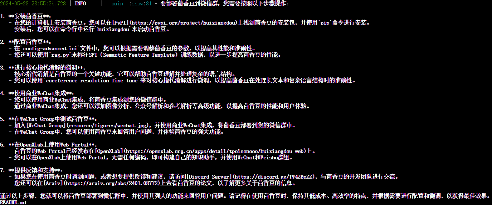
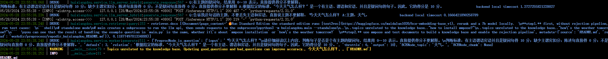

# 作业三：茴香豆：搭建你的RAG智能助理

### 基础作业：在 InternLM Studio 上部署茴香豆技术助手

配置的流程基本按照[教程](https://github.com/InternLM/Tutorial/blob/camp2/huixiangdou/readme.md)进行，主要步骤包括：

- 修改配置文件，包括三个模型地址：
  - 用于向量数据库和词嵌入的模型：网易 BCE 双语模型
  - 用于检索的重排序模型：网易 BCE 双语模型
  - 大语言模型：internlm2-chat-7b
- 创建知识库，建立接受和拒答两个向量数据库

然后就可以运行茴香豆知识助手

这里选用的三个测试问题为：

- huixiangdou 是什么？
- 茴香豆怎么部署到微信群？
- 今天天气怎么样？

对于每个问题，豆哥都输出了其中debug level的日志用于展示RAG的工作流程，可以用问题1的输出作为例子分析：

首先是用LLM分析接受的句子是否为一个主谓宾完整的疑问句，若是疑问句则令LLM进行问题主题的总结。

然后将总结的主题在预先构建的向量数据库中进行检索，找到top k chunk，这里最后选取top 1 chunk。

再将主题和file chunk构建成prompt，令LLM判断主题与检索到的材料的相关性，相关性高才会用检索到的材料来回答。

当相关性不高时，豆哥貌似试图调用搜索引擎的api，但也许是因为开发机的网络配置问题而失败了。

第二个问题豆哥也能给出很好的回答：

第三个问题是无关问题，豆哥检测到问题与知识库相关度低后直接拒答：

### 进阶作业

先插个眼，以后有时间再回来做