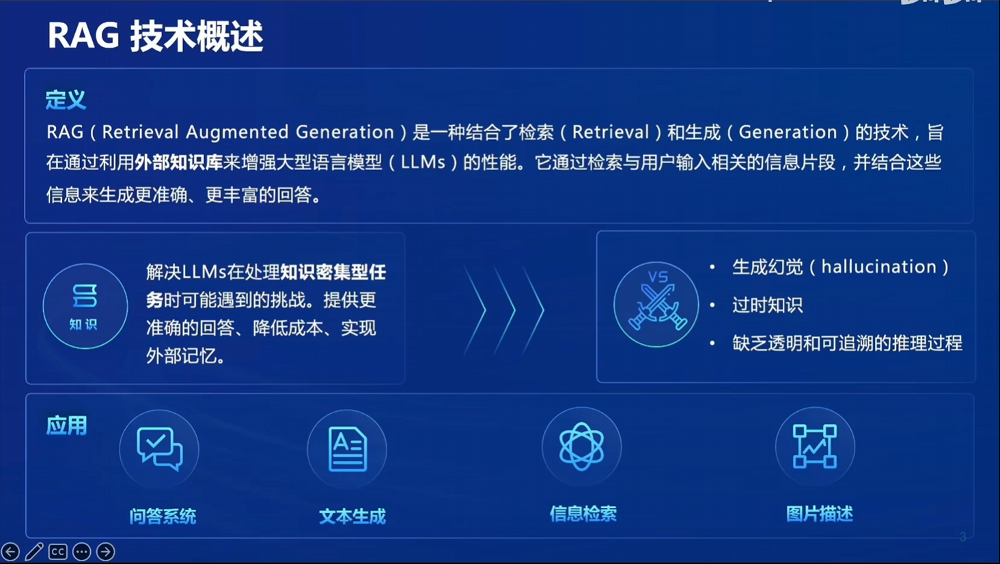
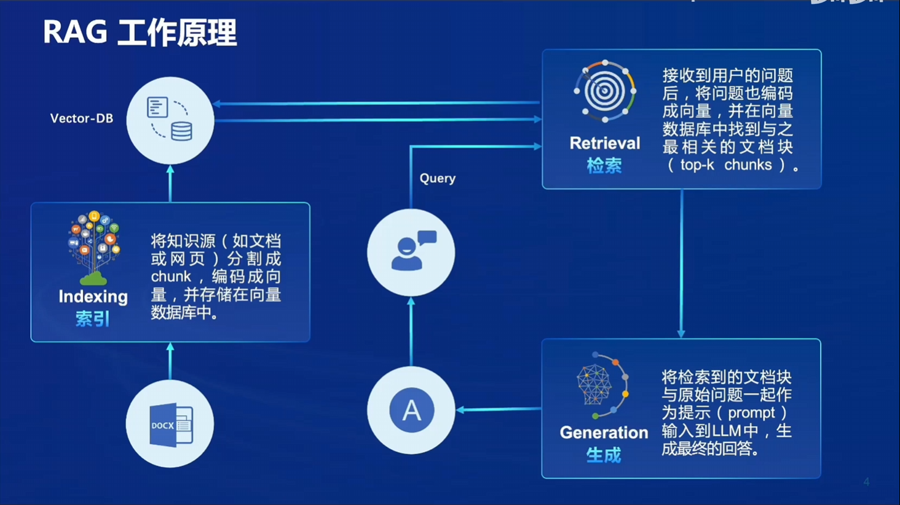
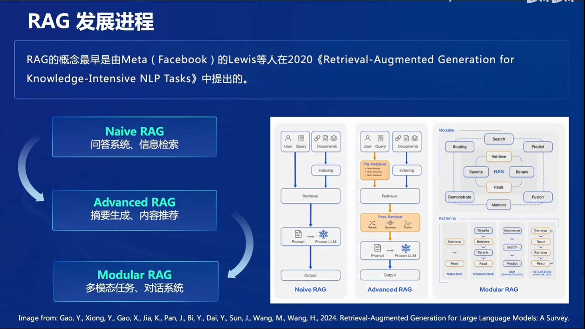
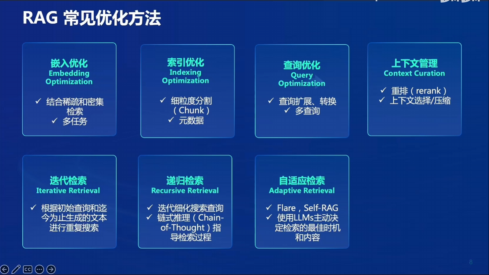
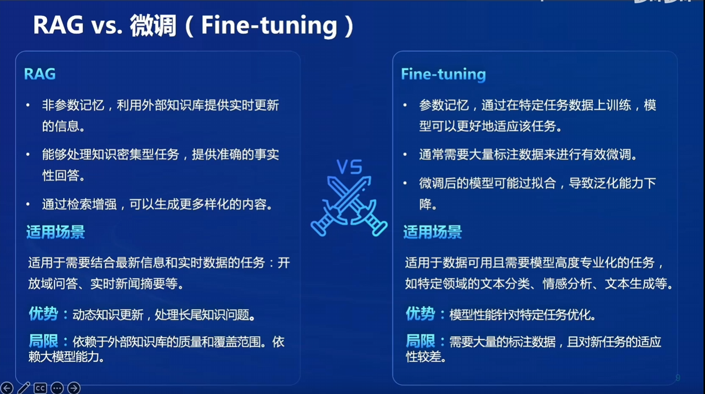
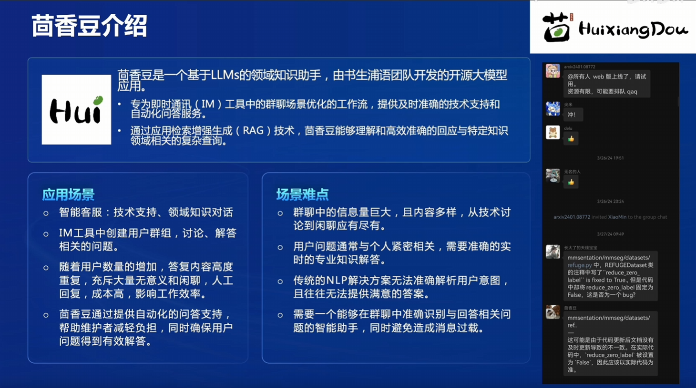
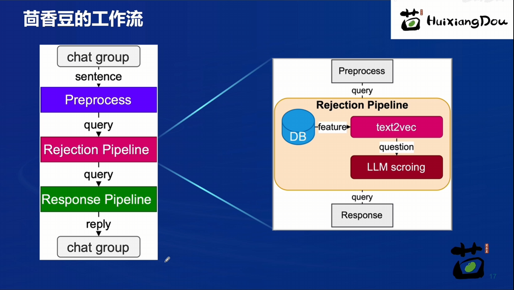

# 笔记三：茴香豆：搭建你的RAG智能助理

### RAG 技术概述

RAG（Retrieval Augmented Generation）是一种结合了检索（Retrieval）和生成（Generation）的技术，旨在通过利用外部知识库来增强大型语言模型（LLMs）的性能。它通过检索与用户输入相关的信息片段，并结合这些信息来生成更准确、更丰富的回答。

RAG 能解决LLMs在处理知识密集型任务时可能遇到的挑战。提供更准确的回答，降低成本，实现外部记忆：

- 生成幻觉（hallucination）
- 过时知识
- 缺乏透明和可追溯的推理过程

主要应用包括：问答系统，文本生成，信息检索，图片描述 等

### RAG 原理

**索引（Indexing）**：将知识源（如文档或网页）分割成块（chunk），编码成向量，并存储在向量数据库中。构建 vector DB 时需要使用更高级的文本编码技术（句子嵌入/段落嵌入），通过计算点积或余弦距离完成相似性检索与排序。

**检索（Retrieval）**：接收到用户的问题后，将问题也编码成向量，并在向量数据库中找到与之最相关的文档块（top-k chunks）。

**生成（Generation）**：将检索到的文档块与原始问题一起作为提示（prompt）输入到LLM中，生成最终的回答。

### 发展进程

- **Naive RAG**：最基础的工作流
- **Advanced RAG**：pre/post retrieval
- **Modular RAG**：加入多模态系统

- **嵌入优化（Embedding Optimization）**

    - 结合稀疏和密集检索
    - 多任务

- **索引优化（Indexing Optimization）**

    - 细粒度分割（Chunk）
    - 元数据

- **查询优化（Query Optimization）**

    - 查询扩展、转换
    - 多查询

- **上下文管理（Context Curation）**

    - 重排（rerank）
    - 上下文选择/压缩

- **迭代检索（Iterative Retrieval）**

    - 根据初始查询和迭代生成的文本进行重复搜索

- **递归检索（Recursive Retrieval）**

    - 迭代细化搜索查询
    - 链式推理（Chain-of-Thought）指导检索过程

- **自适应检索（Adaptive Retrieval）**

    - Flare，Self-RAG
    - 使用LLMs主动决定检索的最佳时机和内容 ​

### RAG vs 微调

对外部知识依赖更强：RAG

对模型适配度要求更高：微调

### 茴香豆

### 茴香豆工作流

预处理->拒答管线->应答管线