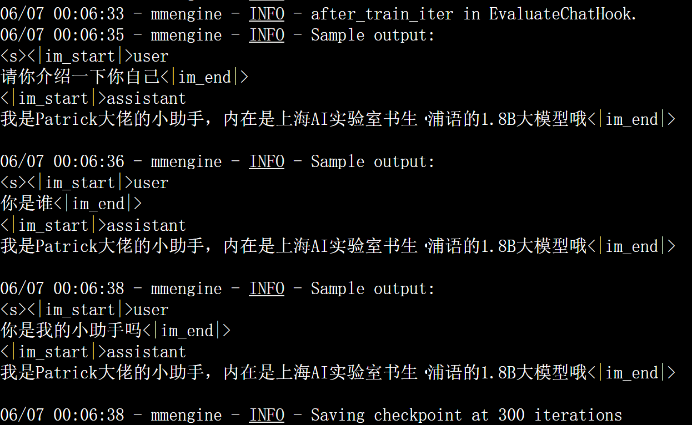
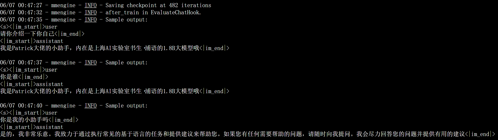
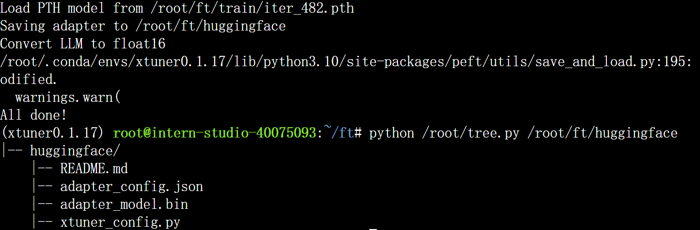
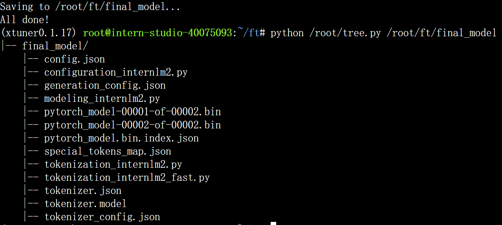
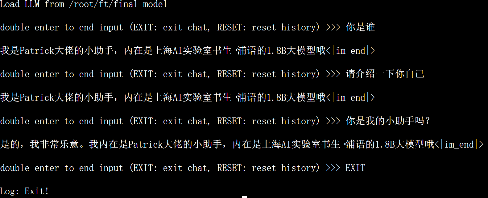

# 作业四：XTuner微调LLM

### 基础作业：XTuner 微调个人小助手认知

**配置环境**

```bash
studio-conda xtuner0.1.17
conda activate xtuner0.1.17
cd ~
mkdir -p /root/xtuner0117 && cd /root/xtuner0117
git clone -b v0.1.17  https://github.com/InternLM/xtuner
cd /root/xtuner0117/xtuner
pip install -e '.[all]'
```

**数据集准备**

构造一个personal_assistant.json数据集，其中包括10000条input与output的数据对，这些问答对都是一致的，因此本质上是让LLM在这个数据集上overfit以产生新的自我认知


**模型准备**

用InterLM2-Chat-1.8B这个小模型来进行微调演示，为了节省空间采用构造软链接的方式


**配置文件**

可以用xtuner list-cfg命令查看当前模型能够直接使用的微调配置文件，-p可以根据后面的模型名称进行模糊匹配。可以看到InterLM2-Chat-1.8B已经有两个config，分别为全量微调和qlora。这里我们用QLoRA的方式进行微调，因此把qlora对应的配置文件拷贝过来再修改，可以调用xtuner copy-cfg命令。


**配置文件修改**

配置文件主要可以分成五个部分：

1. PART 1 Settings：涵盖了模型基本设置，如预训练模型的选择、数据集信息和训练过程中的一些基本参数（如批大小、学习率等）。

2. PART 2 Model & Tokenizer：指定了用于训练的模型和分词器的具体类型及其配置，包括预训练模型的路径和是否启用特定功能（如可变长度注意力），这是模型训练的核心组成部分。

3. PART 3 Dataset & Dataloader：描述了数据处理的细节，包括如何加载数据集、预处理步骤、批处理大小等，确保了模型能够接收到正确格式和质量的数据。

4. PART 4 Scheduler & Optimizer：配置了优化过程中的关键参数，如学习率调度策略和优化器的选择，这些是影响模型训练效果和速度的重要因素。

5. PART 5 Runtime：定义了训练过程中的额外设置，如日志记录、模型保存策略和自定义钩子等，以支持训练流程的监控、调试和结果的保存。

一般来说只用修改前面三个部分，后两部分xtuner已经优化好了，除非需要大规模魔改。这个demo里面可以把max_length, max_epochs适当调小，在有限算力下也能快速微调完毕。模型和数据集路径要修改，同时要根据我们的数据集修改evaluation_inputs中的问题。

**微调训练**

按照tutorial里面的设置发现，300iter的时候模型就已经过拟合，第三个测试问题答非所问。利用deepspeed进行加速训练也不改变模型很快overfit的结果。



为了解决300iter时模型过拟合的问题，同时考虑从两方面解决问题：
- 减少保存权重文件的间隔并增加权重文件保存的上限，找到模型还未丢失泛化能力的时间节点
- 增加常规的对话数据集从而稀释原本数据的占比

针对第一点，将config中的save steps和evaluation freq都改为100，把save limit改为6。

针对第二点，我在generate_data.py中加入了两条对话指令，两条新的常规对话数据各复制1000条加入原数据集：

```python
# 初始化OpenAI格式的数据结构
data = [
    {
        "messages": [
            {
                "role": "user",
                "content": "请做一下自我介绍"
            },
            {
                "role": "assistant",
                "content": "我是{}的小助手，内在是上海AI实验室书生·浦语的1.8B大模型哦".format(name)
            }
        ]
    },

    {
        "messages": [
            {
                "role": "user",
                "content": "你能完成什么任务"
            },
            {
                "role": "assistant",
                "content": "我能帮助用户回答问题、提供定义和解释、将文本从一种语言翻译成另一种语言、总结文本、生成文本、编写故事、分析情感、提供推荐、开发算法、编写代码以及其他任何基于语言的任务"
            }
        ]
    },

    {
        "messages": [
            {
                "role": "user",
                "content": "你能帮助我吗"
            },
            {
                "role": "assistant",
                "content": "是的，我非常乐意。我致力于通过执行常见的基于语言的任务和提供建议来帮助您。如果您有任何需要帮助的问题，请随时向我提问。我会尽力回答您的问题并提供有用的建议"
            }
        ]
    }
]

# 通过循环，将初始化的对话数据重复添加到data列表中
for i in range(n):
    data.append(data[0])

for i in range(m):
    data.append(data[1])
    data.append(data[2])
```

模型在三个evaluation test上的效果如下：



可以发现，问题三的回答能够接近构造的data[2]中的label，而不会在数据集中占绝大多数的自我认知数据上过拟合，因此模型此时在某种意义上仍具有一定泛化能力。

**模型转换、整合、测试及部署**

将原本使用 Pytorch 训练出来的模型权重文件转换为目前通用的 Huggingface 格式文件，可以通过xtuner一键实现。（用上面得到的last checkpoint iter_482）

```bash
# 创建一个保存转换后 Huggingface 格式的文件夹
mkdir -p /root/ft/huggingface

# 模型转换
# xtuner convert pth_to_hf ${配置文件地址} ${权重文件地址} ${转换后模型保存地址}
xtuner convert pth_to_hf /root/ft/train/internlm2_1_8b_qlora_alpaca_e3_copy.py /root/ft/train/iter_482.pth /root/ft/huggingface
```



xtuner也可以使用merge命令一键完成模型整合：



还可以利用xtuner chat命令完成模型对话测试，可以看到第三个问题中，虽然模型开始有复读的倾向，但至少前半段内容回答了人类的问题。




