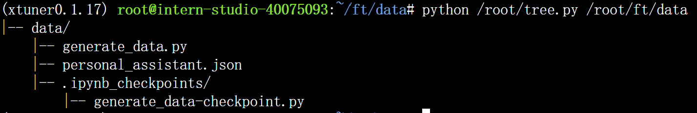
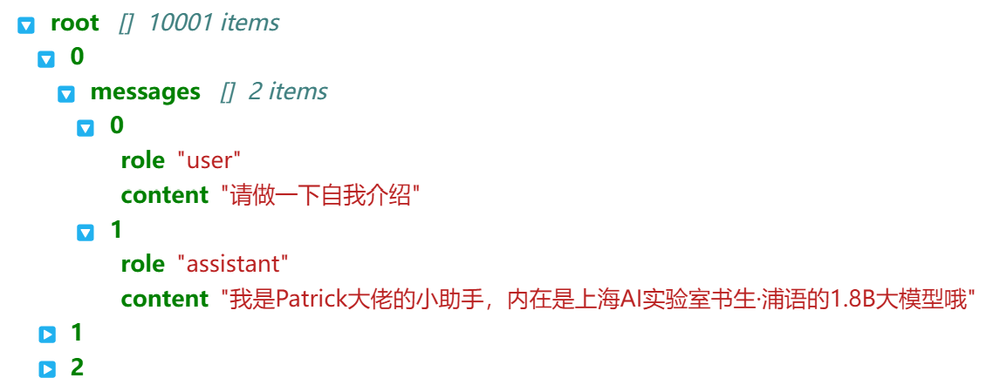
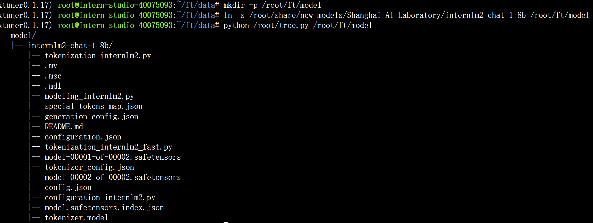
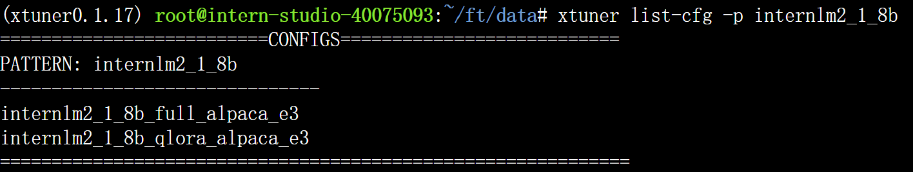

# 作业四：XTuner微调LLM

### 基础作业：XTuner 微调个人小助手认知

**配置环境**

```bash
studio-conda xtuner0.1.17
conda activate xtuner0.1.17
cd ~
mkdir -p /root/xtuner0117 && cd /root/xtuner0117
git clone -b v0.1.17  https://github.com/InternLM/xtuner
cd /root/xtuner0117/xtuner
pip install -e '.[all]'
```

**数据集准备**

构造一个personal_assistant.json数据集，其中包括10000条input与output的数据对，这些问答对都是一致的，因此本质上是让LLM在这个数据集上overfit以产生新的自我认知





**模型准备**

用InterLM2-Chat-1.8B这个小模型来进行微调演示，为了节省空间采用构造软链接的方式



**配置文件**

可以用xtuner list-cfg命令查看当前模型能够直接使用的微调配置文件，-p可以根据后面的模型名称进行模糊匹配。可以看到InterLM2-Chat-1.8B已经有两个config，分别为全量微调和qlora。这里我们用QLoRA的方式进行微调，因此把qlora对应的配置文件拷贝过来再修改，可以调用xtuner copy-cfg命令。



**配置文件修改**

配置文件主要可以分成五个部分：

1. PART 1 Settings：涵盖了模型基本设置，如预训练模型的选择、数据集信息和训练过程中的一些基本参数（如批大小、学习率等）。

2. PART 2 Model & Tokenizer：指定了用于训练的模型和分词器的具体类型及其配置，包括预训练模型的路径和是否启用特定功能（如可变长度注意力），这是模型训练的核心组成部分。

3. PART 3 Dataset & Dataloader：描述了数据处理的细节，包括如何加载数据集、预处理步骤、批处理大小等，确保了模型能够接收到正确格式和质量的数据。

4. PART 4 Scheduler & Optimizer：配置了优化过程中的关键参数，如学习率调度策略和优化器的选择，这些是影响模型训练效果和速度的重要因素。

5. PART 5 Runtime：定义了训练过程中的额外设置，如日志记录、模型保存策略和自定义钩子等，以支持训练流程的监控、调试和结果的保存。

一般来说只用修改前面三个部分，后两部分xtuner已经优化好了，除非需要大规模魔改。这个demo里面可以把max_length, max_epochs适当调小，在有限算力下也能快速微调完毕。模型和数据集路径要修改，同时要根据我们的数据集修改evaluation_inputs中的问题。这个账号开了50% A100权限，为了尽量把显存吃满，把batch size per device改成了4。

**常规训练**

