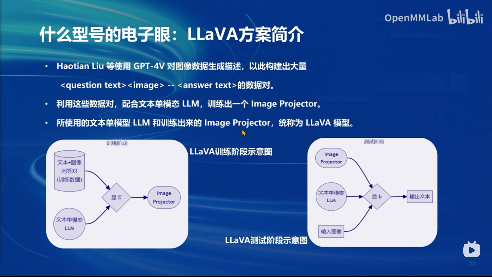

# 笔记四：XTuner微调LLM

### 微调大模型的两种范式

**增量预训练微调**

用没有标签的文章、书籍、代码让大模型学到更多的知识，例如某个垂类领域的常识

**指令微调**

构造高质量的对话、问答数据，让模型学会对话模板，能根据人类指令进行对话。

**数据处理流程**

- 原始数据：单纯的对话
- 标准格式数据：加入system/user/assistance这类角色提示
- 添加对话模板：符合对话模板的json格式
- Token化：将每个句子进行分词，加入一些开始/结束标识符等。
- 添加label：只取对话中的回答部分，移位作为label
- 开始训练：用tokenizer转化为embedding用于LLM训练

**LoRA**

Low-Rank Adaptation，在原本的LLM旁边加上两个小的Linear支路（adapter），用LLM的输出加上adapter的输出作为微调模型最后的输出。LLM的参数freeze，并且不用存梯度，只有adapter的参数更新。感觉有点类似于学了一个encoder-decoder用于表达模型微调前后输出的残差，这个encoder-decoder是一个类似VAE的结构，能够把高维的输入压缩到一个低维的latent space（体现low-rank），再从这个低维tensor还原残差。

**多模态LLM**

关键在于训练一个image projector，对输入image进行token化。

可以用GPT-4V等模型对图像数据生成描述文本（caption），构建出大量（question text, image -> answer text）的数据对，配合原始的文本LLM训练出一个image projector的小模型，这种方案被称为**LLaVA**。pretrain阶段可以被理解为增量预训练，finetune阶段可以被理解为指令微调。这个image projector就类似于LoRA中的adapter。

