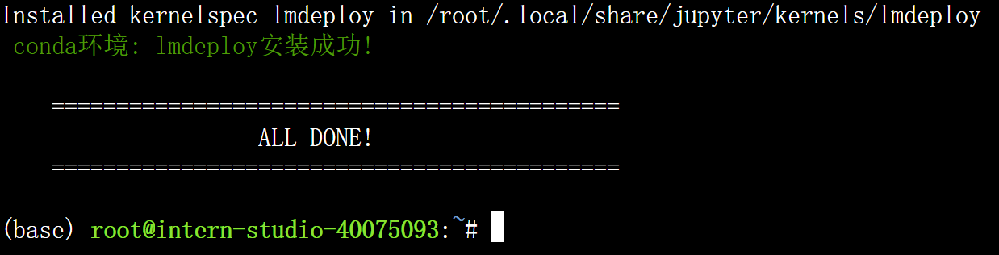
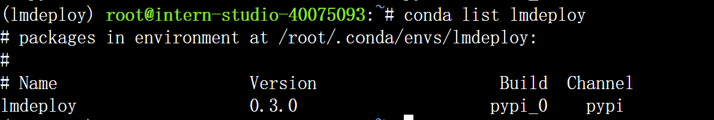
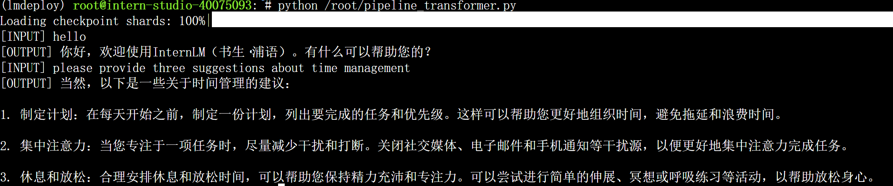
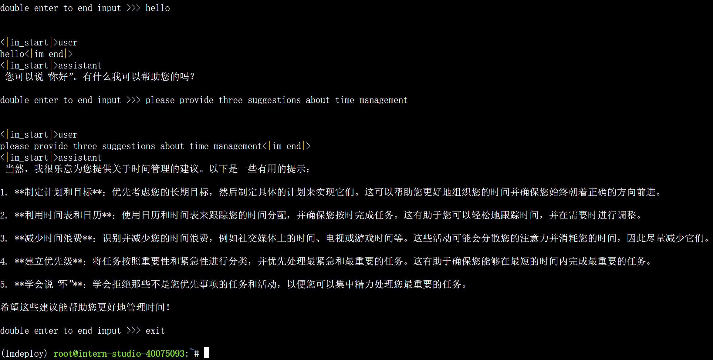
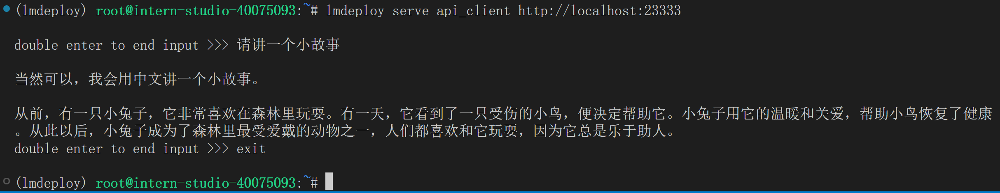
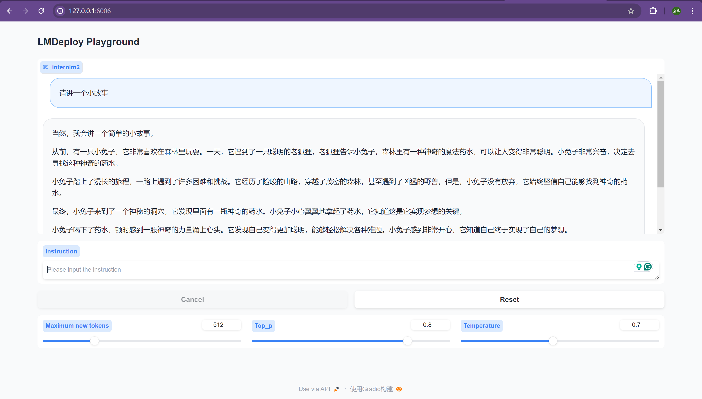
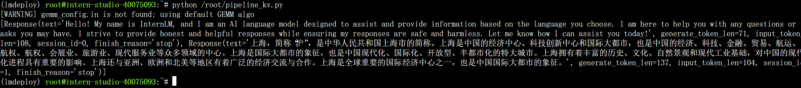

# 作业五：LMDeploy量化部署LLM & VLM实践

### 基础作业：LMDeploy环境部署

创建conda环境：



安装LMDeploy：



### 基础作业：LMDeploy模型对话（chat）

还是用软链接的方式声明存放模型的目录，随后使用Transformer库直接运行模型，生成两个response共计用时约19s



然后使用lmdeploy进行推理，生成两个response共计用时约9s，明显更快，但这里输出了5条建议，指令跟随的能力变差了



### 进阶作业：LMDeploy模型量化

运行lmdeploy lite指令对1.8b模型进行4-bit量化，并指定KV Cache比例为0.4，此时显存的占用量为4936MB，对于问题2的响应时间少于2s，但输出了8条建议，指令跟随的能力更差了


### 进阶作业：LMDeploy服务(serve)

运行lmdeploy serve api_server命令启动API服务器，然后在本机启动ssh服务，查看fast api


**命令行客户端连接API服务器**



**网页客户端连接API服务器**



### 进阶作业：Python代码集成

创建脚本pipeline_kv.py并填入以下内容：

```python
from lmdeploy import pipeline, TurbomindEngineConfig

# 调低 k/v cache内存占比调整为总显存的 40%
backend_config = TurbomindEngineConfig(cache_max_entry_count=0.4)

pipe = pipeline('/root/internlm2-chat-1_8b-4bit',
                backend_config=backend_config)
response = pipe(['Hi, pls intro yourself', '上海是'])
print(response)
```

即可实现用python代码集成的方式运行internlm2-chat-1.8b模型，并使用W4A16量化，调整KV Cache的占用比例为0.4



### 进阶作业：使用 LMDeploy 运行视觉多模态大模型 llava gradio demo


看得出来llava对中文支持不太好，很多量词都用得有问题，而且后面开始复读，量化部署对llava的性能影响比较大