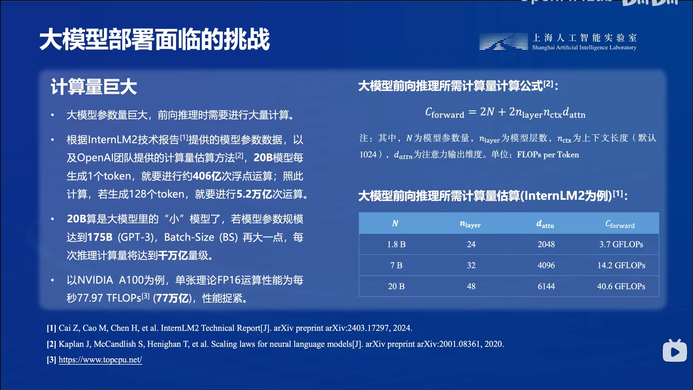
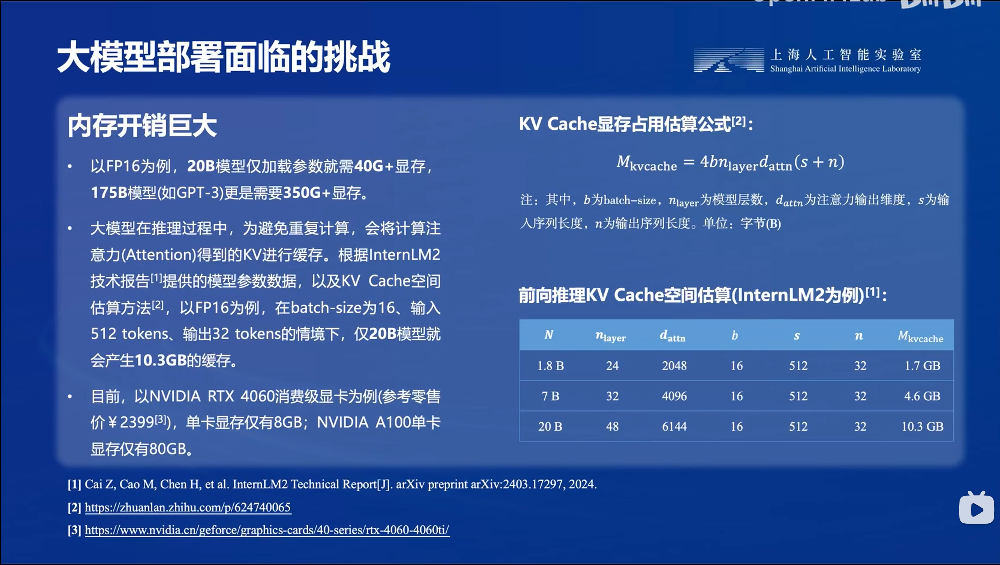
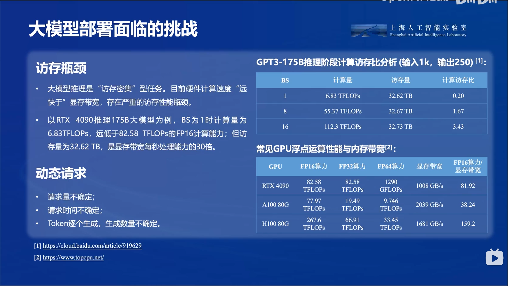
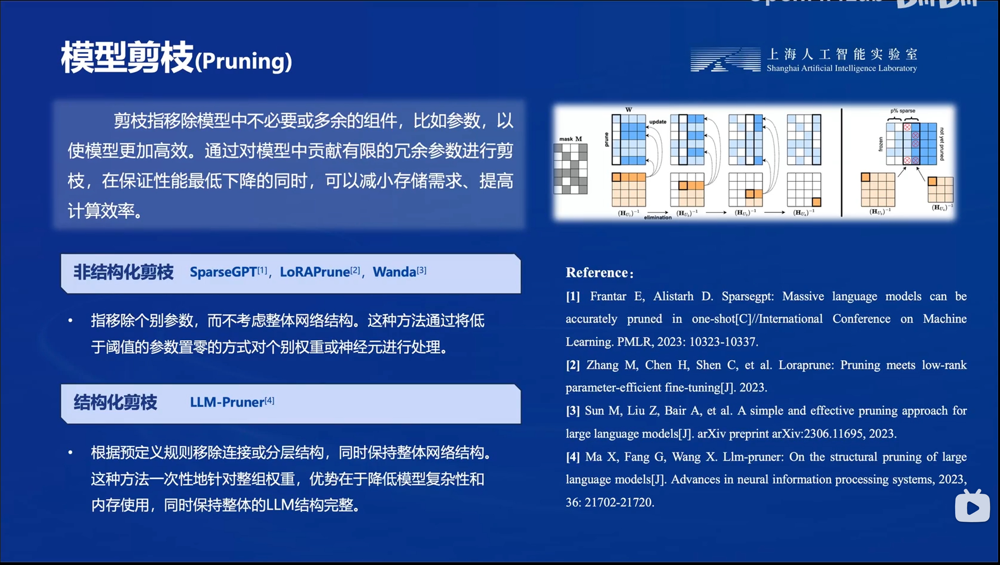
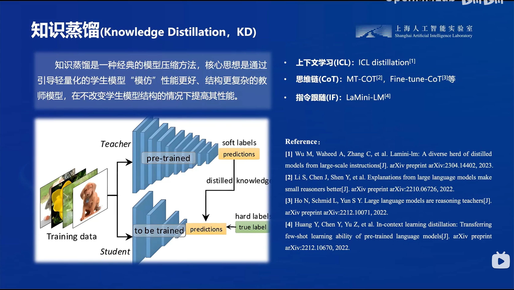
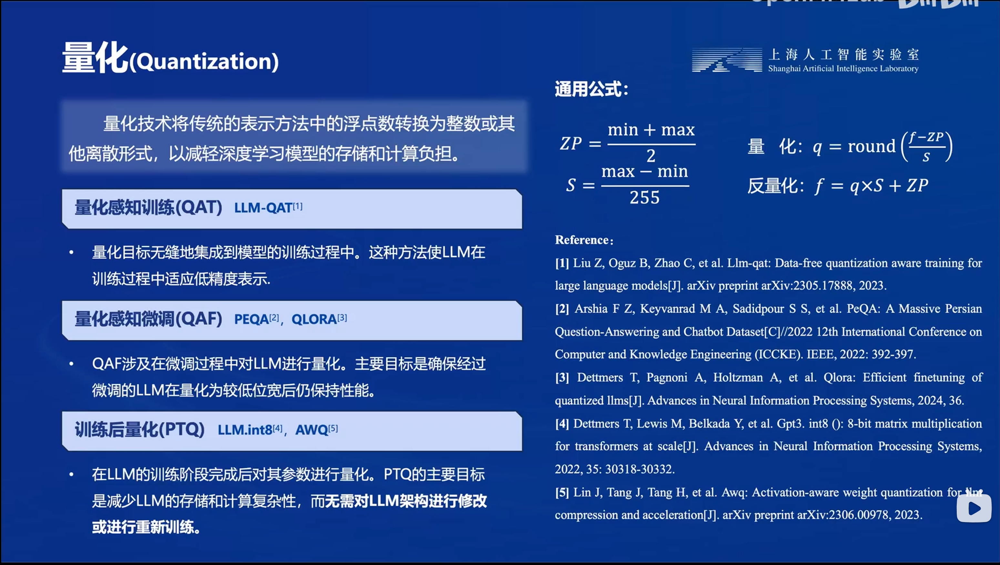

# 笔记五：LMDeploy量化部署

### LLM部署面临的挑战

**计算量**

scaling law：

$$
C_{\text{forward}}=2N+2n_{\text{layer}}n_{\text{ctx}}d_{\text{attn}}
$$

其中$N$为模型参数量，$n_{\text{layer}}$为模型层数，$n_{\text{ctx}}$为上下文长度，$d_{\text{attn}}$为注意力输出维度。

**内存开销**

显存除了要用于加载模型参数，还要用来用作KV Cache，对注意力计算得到的KV进行缓存。KV Cache显存占用公式：

$$
M_{\text{KV Cache}}=4bn_{\text{layer}}d_{\text{attn}}(s+n)
$$

其中$b$为batch size，$n_{\text{layer}}$为模型层数，$d_{\text{attn}}$为注意力输出维度，$s,n$分别为输入输出序列的长度。

**访存瓶颈&动态请求**

访存瓶颈：硬件计算速度远大于显存带宽

动态请求：实际应用场景下，用户的请求量不确定，请求时间也不统一，token生成数量不确定（同一个batch中，有的请求token生成完毕而有的没有）

### 常用部署方法

**剪枝**

- 非结构化剪枝：移除满足特定条件的权重，将低于设定阈值的权重置零
- 结构化剪枝：直接根据预设规则移除部分连接/分层结构，保留网络整体结构

**知识蒸馏**

先训练大参数量的teacher network，用teacher的示教结果去训练一个小参数量的student network，达到减少参数量同时迁移知识的目的。

**量化**

- 量化感知训练
- 量化感知微调
- 训练后量化

量化降低存储空间：将占用空间大的浮点数转化为占用空间小的定点数/整数

量化提高计算效率：量化本身其实对于每个权重而言都增加了计算量，但由于整体存储空间减少了，访存量大大减少，而访存量才是计算瓶颈，所以量化是从降低访存量的角度实现计算效率的提高

