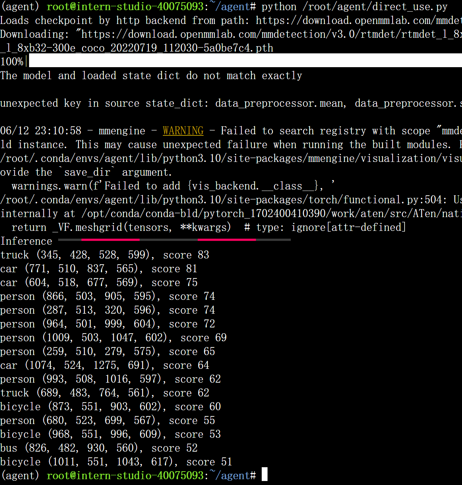

# 作业六：Lagent & AgentLego 智能体应用搭建

### 基础作业：Lagent Web Demo 使用

按照文档配置环境并安装lmdeploy, lagent, agentlego等依赖项后，首先启动terminal开一个LMDeploy api_server：

然后在另一个terminal中启动web demo：

最后在本机上ssh访问web page：

结果基本与文档描述一样，能够完成用户指令，但给出了额外信息

### 基础作业：AgentLego 直接使用

直接调用AgentLego中的目标检测api，而不是由LLM去调用。AgentLego 所实现的目标检测工具是基于 mmdet (MMDetection) 算法库中的 RTMDet-Large 模型。

运行direct_use.py可以输出以下目标检测结果：

原图：

目标检测图：

可以看到AgentLego中的目标检测工具能够对原图中的实体进行检测，输出label, score, bounding box