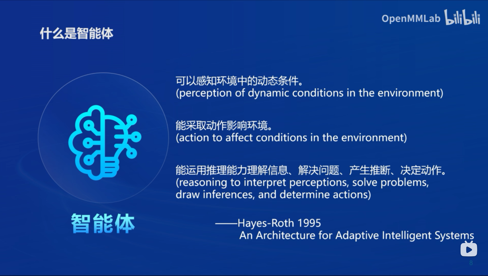
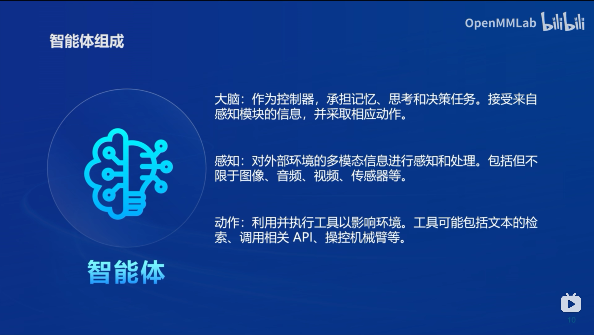
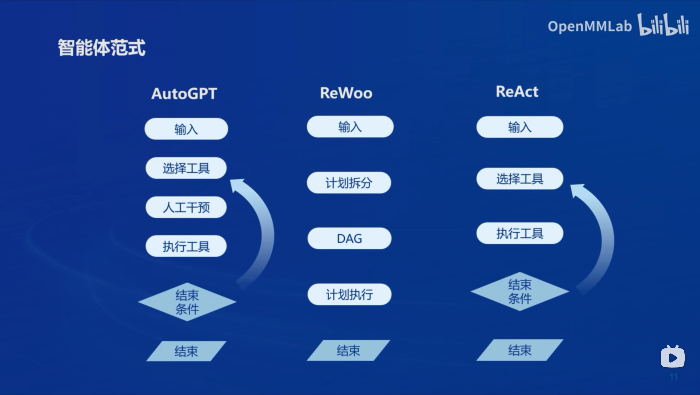
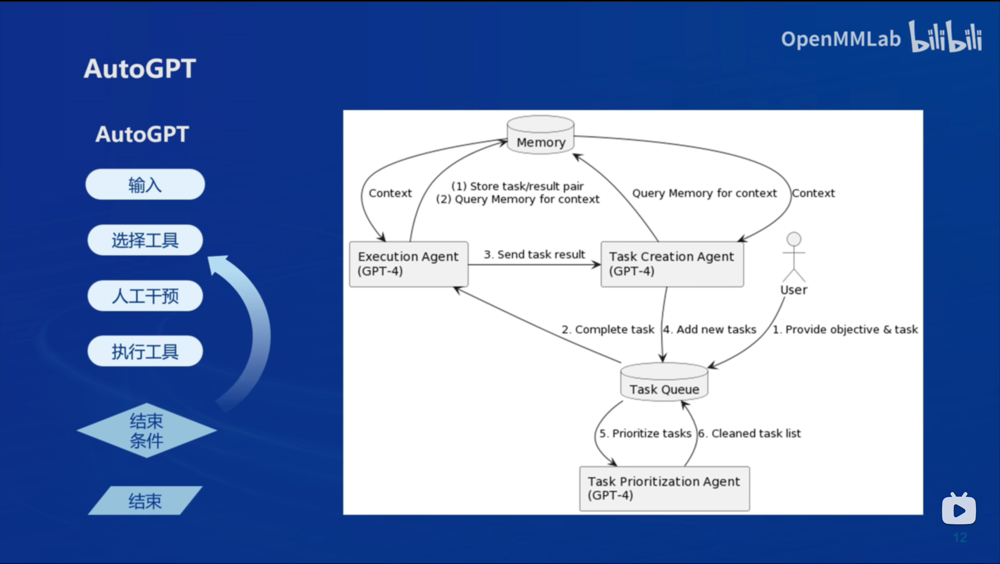
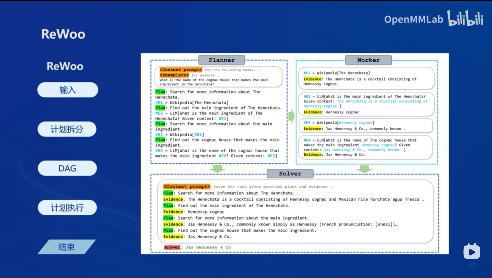
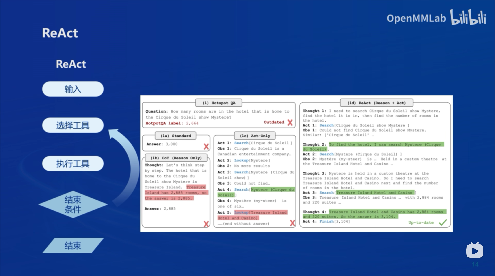
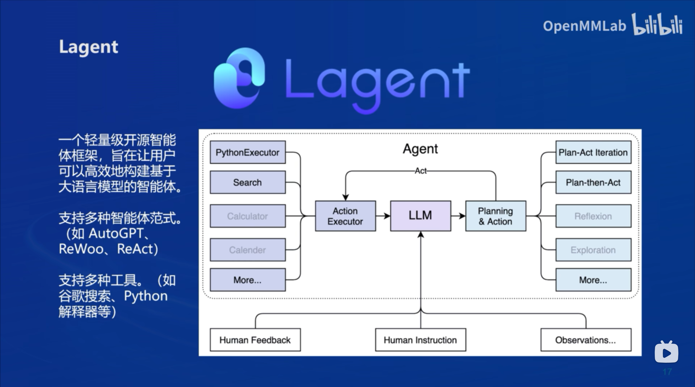
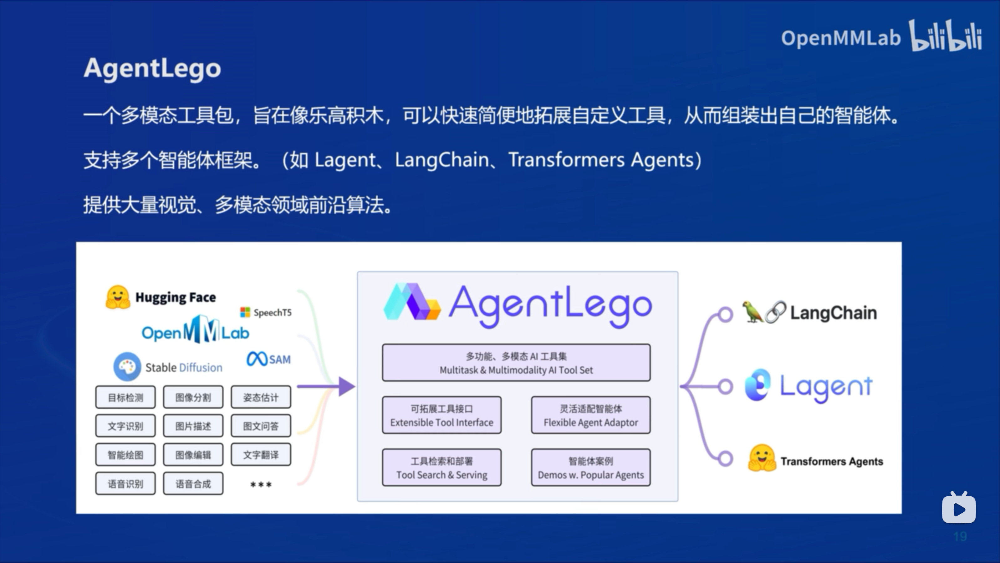

# 笔记六：Lagent & AgentLego 智能体应用搭建

### 什么是智能体

智能体定义：

- 可以感知环境中的动态条件
- 能采取动作影响环境
- 能运用推理能力理解信息、解决问题、产生推断、决定动作

智能体主要由三部分组成：

- **大脑**：作为控制器承担记忆、思考和决策任务，接受来自感知模块的信息，并采取相应动作
- **感知**：对外部环境的多模态信息进行感知和处理，包括但不限于图像、音频、视频、传感器等
- **动作**：利用并执行工具以影响环境。工具可能包括文本的检索、调用相关API、操控机械臂等

从强化学习的视角，一个具有落地价值的agent要具有三部分的能力，感知，决策，执行。目前多模态大模型可以完成感知+决策的任务，但语言形式的决策输出需要依赖相关的执行器来完成动作，即需要LLM的agent化

### Agent范式

大模型Agent主要遵循三种范式：**AutoGPT**，**ReWoo**，**ReAct**

**AutoGPT**

包括三个agent分别负责task creation, task prioritization, excution

**ReWoo**

将用户输入进行计划拆分，将工具间的依赖形成有向无环图（DAG），按图执行。Planner，Worker，Solver组件。

**ReAct**

模型会不断思考是否需要使用下一个工具，直至完成用户输入（终止条件），结合推理与行为

### Lagent & AgentLego

**Lagent**

开源智能体框架，支持多种智能体范式，支持多种工具（搜索引擎，python解释器等）

**AgentLego**

多模态工具包，支持多个智能体框架（Lagent，LangChain，Transformer Agents），同时提供了大量视觉与多模态的前沿算法用于下游任务

