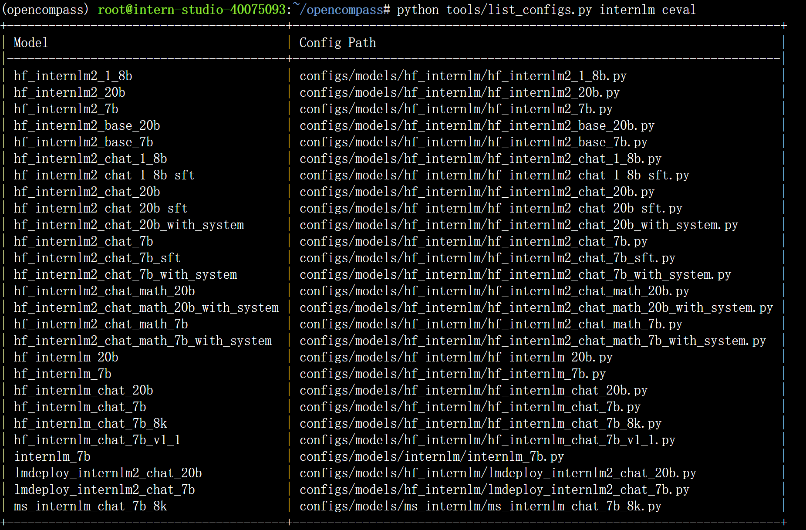
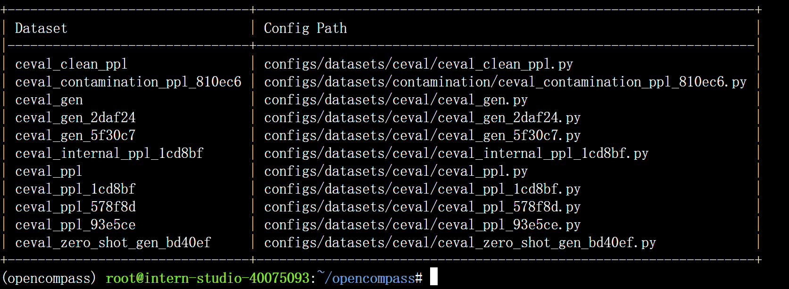
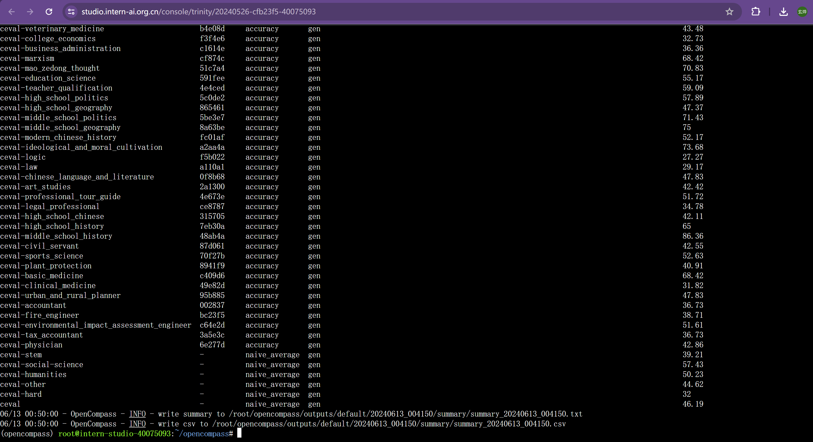

# 作业七：OpenCompass大模型评测

### 基础作业

在安装环境以及准备依赖项、评测数据集后，运行以下命令可以查看模型与数据集相关配置文件：

```bash
python tools/list_configs.py internlm ceval
```





随后运行以下命令启动评测

```bash
python run.py --datasets ceval_gen --hf-path /share/new_models/Shanghai_AI_Laboratory/internlm2-chat-1_8b --tokenizer-path /share/new_models/Shanghai_AI_Laboratory/internlm2-chat-1_8b --tokenizer-kwargs padding_side='left' truncation='left' trust_remote_code=True --model-kwargs trust_remote_code=True device_map='auto' --max-seq-len 1024 --max-out-len 16 --batch-size 2 --num-gpus 1 --debug
```

评测结果：



可以看到interlm2-chat-1.8b模型在stem领域上的性能欠佳，在social science领域上性能较好，这可能是因为stem领域对逻辑推理能力要求更高，而社会科学中的任务与自然语言更贴近。