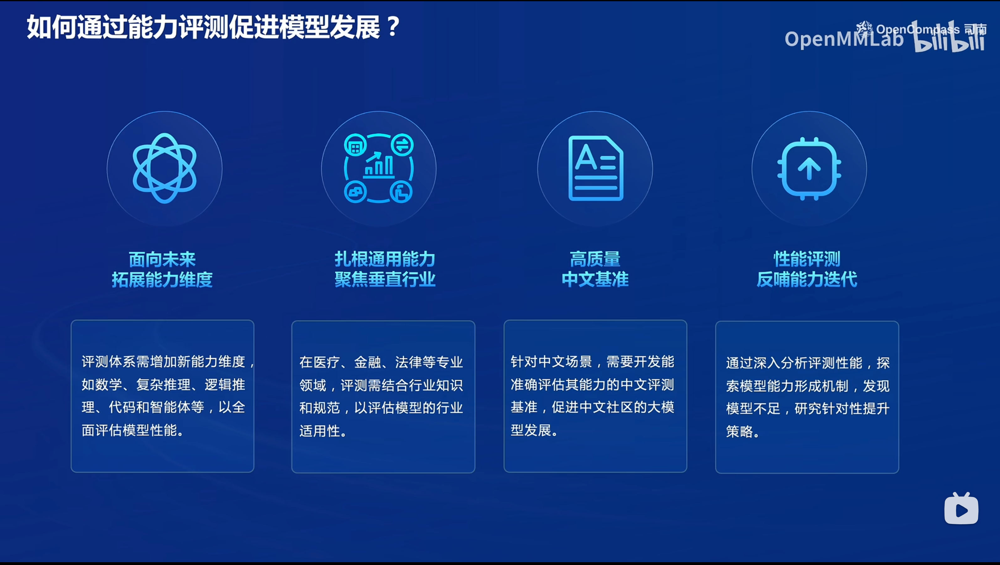
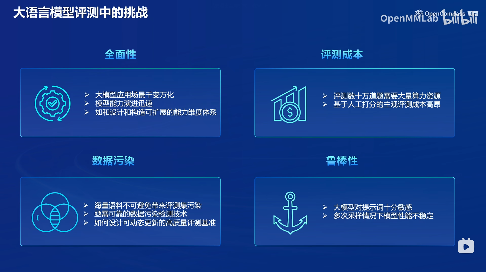
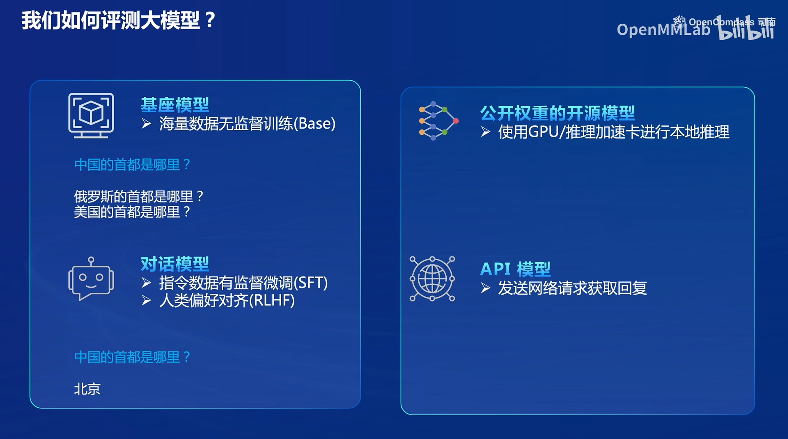
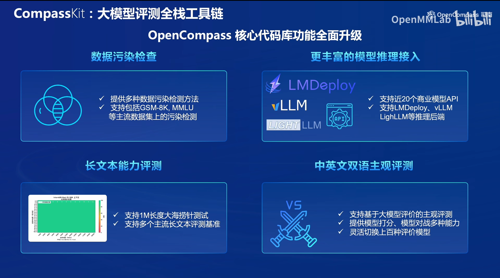
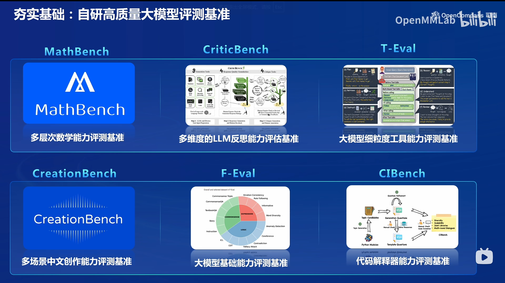

# 笔记七：OpenCompass大模型评测

**如何通过能力评测促进大模型发展？**

- 拓展评测维度，全面评估大模型性能
- 垂直行业应用，结合行业知识和规范，评估模型的行业适用性
- 高质量中文基准，促进中文社区大模型的发展
- 性能评测能够探索模型能力形成机制，发现不足，并针对性研究提升策略

**大模型评测的挑战**

- 全面性：应用场景和模型能力在不断演进，评测体系也应该具有可扩展性
- 评测成本：评测需要大量算力资源，人工打分的评测成本极高
- 数据污染：评测集可能被包含在训练时的海量不公开语料中，需要研究数据污染检测技术，评测基准需要动态更新
- 鲁棒性：评测时需要考虑大模型对提示词的敏感性

**如何评测大模型**

可以在本地使用开源大模型进行推理评测，也可以调用api请求闭源大模型实现能力评测

- 客观评测：让大模型去回答具有客观正确答案的题目
- 主观评测：文本/图像等生成式任务中引入人类打分或其他模型打分（常用GPT4作为打分模型）
- 提示词工程：解决大模型对提示词的敏感依赖，引导大模型在评测过程中发挥更好的表现
- 长文本评测：指令跟随、长文本建模、信息抽取（大海捞针）

**OpenCompass评测全栈工具链**

- 数据污染检查
- 丰富的模型推理接入，支持LMDeploy, vLLM, LightLLM等推理后端实现加速
- 长文本能力评测
- 中英文双语主观评测

**OpenCompass自研大模型评测基准**

test